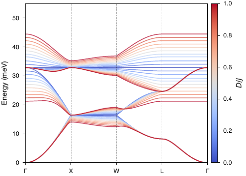
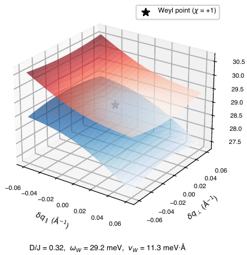
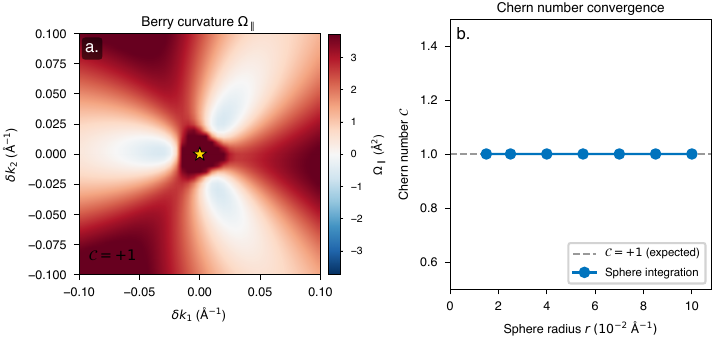
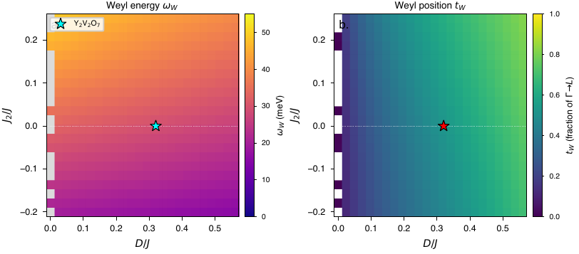
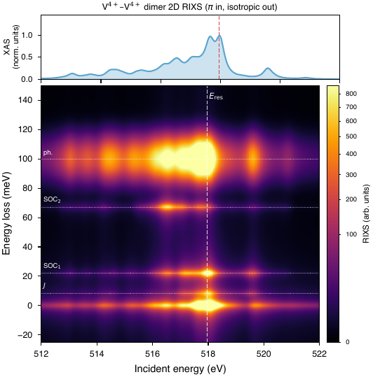
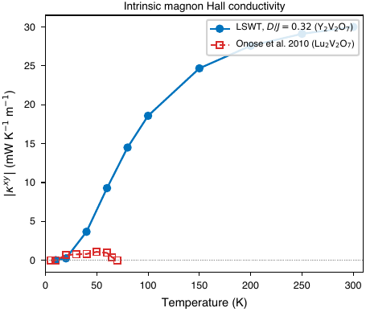

# Topological Weyl Magnons in Y₂V₂O₇: Code and Data

Code repository for the paper
"Topological Weyl Magnons in Y₂V₂O₇: Polarimetric RIXS Signatures and Thermal Hall Response".

## Overview

The pyrochlore ferromagnet Y₂V₂O₇ hosts topological Weyl magnons: linear
band-touching points in the magnon spectrum that act as sources and sinks of
Berry curvature, the bosonic analogue of electronic Weyl semimetals. This
repository holds the scripts that reproduce the manuscript figures. The
calculations fall into four categories:

1. Linear spin-wave theory (LSWT): magnon band structure of the
   Dzyaloshinskii–Moriya pyrochlore ferromagnet via Holstein–Primakoff and
   Colpa–Bogoliubov diagonalization.
2. Topological analysis: Berry curvature, Chern numbers, and surface
   magnon arcs, with a *k·p* effective model for the Weyl point chirality.
3. Thermal (magnon) Hall response: Kubo formula for κ_xy(T), compared
   against transport data.
4. Cluster exact diagonalization (EDRIXS): Kramers–Heisenberg RIXS
   cross-sections for single-site V⁴⁺ and two-site V⁴⁺–V⁴⁺ dimer models,
   including polarization selection rules.

### Key predictions

| Observable | Predicted | RIXS resolution needed | Detectable now? |
|---|---|---|---|
| Weyl magnon energy ω_W | 29 meV, Chern 𝒞 = +1 | 30 meV FWHM | marginal |
| SOC d–d peak | 22 meV | <30 meV | yes |
| Phonon sideband | 100 meV | <30 meV | yes |
| Exchange peak | 8 meV | <10 meV | needs next-gen |

The Weyl point is protected by C₃ symmetry, so it is robust to parameter
uncertainty, and polarimetric RIXS separates magnetic (spin-flip) from
lattice (spin-conserving) excitations. Full derivations are in
[`calculations_explained.pdf`](calculations_explained.pdf): the Hamiltonian,
DM-vector symmetry constraints, the Colpa algorithm, Berry-curvature and
Chern-number definitions, the *k·p* fit, surface-arc slab geometry, the Kubo
formula, and the dimer ED.

## Results

Representative figures (PNG previews; vector PDFs for all panels are in
[`Figures/`](Figures/)):

| Magnon bands (LSWT) | Weyl cone (3D) | Berry curvature / Chern |
|---|---|---|
|  |  |  |
| Topological phase diagram | RIXS 2D map | Magnon thermal Hall κ_xy(T) |
|  |  |  |

- Magnon bands: LSWT dispersion along the high-symmetry path for
  representative D/J ratios. The gapped band touching is the Weyl node.
- Weyl cone: linear magnon dispersion around the band-touching point at
  ω_W ≈ 29 meV.
- Berry curvature / Chern: Berry-curvature concentration at the Weyl
  point, integrating to 𝒞 = +1.
- Phase diagram: topological character across the (D/J) parameter space.
- RIXS 2D map: simulated incident-energy vs energy-loss intensity from
  the two-site cluster ED.
- Thermal Hall: predicted magnon Hall conductivity κ_xy versus
  temperature, compared with experiment.

## Requirements

```
Python >= 3.9
numpy >= 1.22
scipy >= 1.8
matplotlib >= 3.5
edrixs >= 0.0.4   (for RIXS calculations only)
```

Install via:
```bash
conda create -n topo_magnon python=3.10 numpy scipy matplotlib
conda activate topo_magnon
pip install edrixs
```

Or use the provided `environment.yml`:
```bash
conda env create -f environment.yml
conda activate topo_magnon
```

## Scripts

| Script | Description | Figures produced |
|--------|-------------|-----------------|
| `generate_figures.py` | LSWT band structure, Weyl cones, Berry curvature, phase diagram, surface arcs, magnon Hall | `fig_comparison_progression`, `Y2V2O7_band_overlay_DJ`, `fig_weyl_kp_analysis`, `fig_weyl_band_zoom_GL`, `fig_weyl_cone_3D`, `fig_weyl_cone_cuts`, `fig_berry_chern`, `fig_phase_diagram`, `fig_surface_arc`, `fig_magnon_hall` |
| `regen_berry_arc.py` | Standalone Berry curvature + surface arc (faster rerun) | `fig_berry_chern`, `fig_surface_arc` |
| `generate_dimer.py` | Single-site V⁴⁺ EDRIXS + phenomenological dimer RIXS | `fig_vv_dimer` |
| `generate_dimer_full_rixs.py` | Full two-site cluster ED RIXS (Kramers–Heisenberg) | `fig_dimer_full_rixs`, `fig_rixs_2d_map` |
| `generate_xas_overview.py` | V L₂,₃-edge XAS with σ and π polarizations | `fig_xas_overview` |

## Running

Generate all figures:
```bash
python generate_figures.py          # ~2 min (LSWT, no GPU)
python generate_xas_overview.py     # ~5 s
python generate_dimer.py            # ~10 s
python generate_dimer_full_rixs.py  # ~5 min (large ED)
```

All output goes to `Figures/`.

## Physical Parameters

| Parameter | Value | Source |
|-----------|-------|--------|
| J (NN exchange) | 8.22 meV | INS, Lu₂V₂O₇ (Mena et al. 2014) |
| D/J (DM ratio) | 0.32 | Moriya theory estimate |
| S | 1/2 | V⁴⁺ (d¹) |
| a (lattice constant) | 9.89 Å | XRD |
| 10Dq | 1.9 eV | V L-edge XAS fitting |
| ζ₃d | 30 meV | Atomic tables |
| ζ₂p | 4.65 eV | Atomic tables |

## Citation

If you use this code, please cite the associated paper.

## License

MIT License. See `LICENSE` for details.
