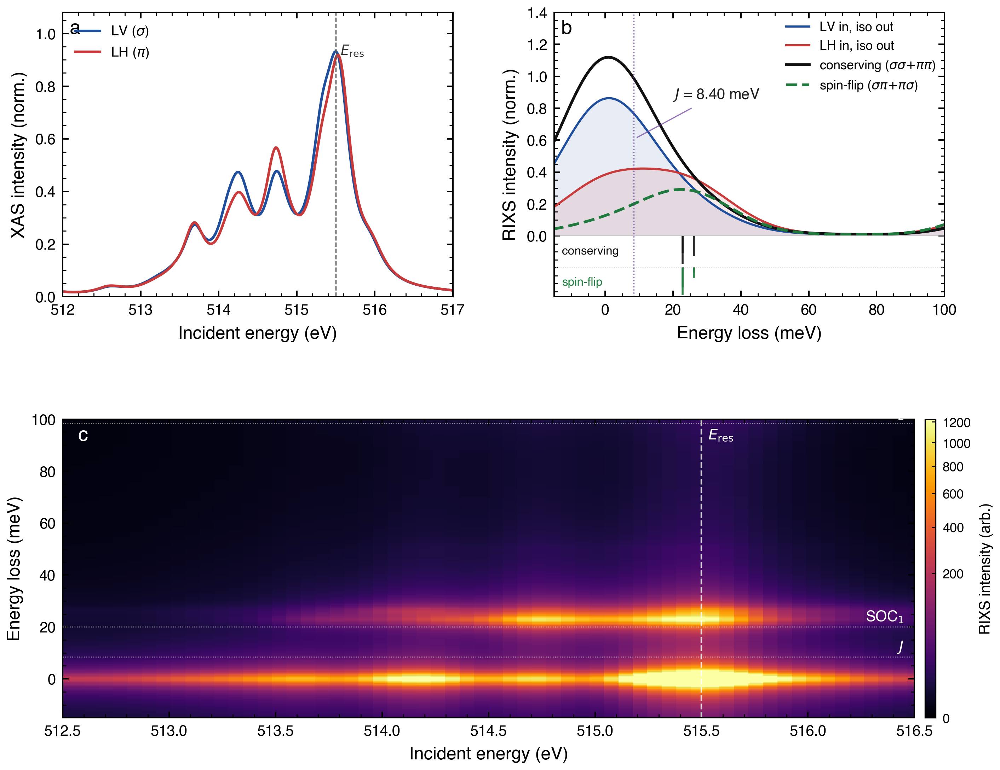

# V–V dimer Two-Impurity Cluster Anderson Model (TICAM) for Y₂V₂O₇

[](https://nsls-ii.github.io/edrixs/)
[](https://www.python.org/)

Extension of the two-site V⁴⁺ cluster calculation with a shared bridging
O 2p bath that hybridises with both V sites.  Captures the
charge-transfer physics that is absent from the pure-dimer model:
covalent ground-state admixture |d²⟩ + α|d³L⁻¹⟩, charge-transfer
satellites, and dynamic core-hole screening in the RIXS intermediate
state.

<p align="center">
  
</p>

> **Looking for the simpler pure two-site cluster (no ligand bath)?**
> That calculation lives in a separate repository:
> [`liamlts/2-site-cluster-Y2V2O7`](https://github.com/liamlts/2-site-cluster-Y2V2O7).

## Contents

- `generate_dimer_anderson.py` — full TICAM calculation.  Dense
  exact-diagonalisation end-to-end; writes three figures to `Figures/`.
- `Figures/` — generated outputs.

## What the calculation does

In addition to everything the pure-dimer script does, the Anderson model:

1. **Ground-state covalency.** Couples the V t₂g manifolds to a shared
   bridging O 2p bath through a spin-diagonal, orbital-isotropic
   hybridisation `V_pd`.  The true ground state becomes
   `|d²⟩ + α|d³L⁻¹⟩` with ⟨n_L⟩ ≈ 4 %.
2. **Charge-transfer physics.** In the core-hole intermediate state the
   static attraction drags ligand charge to the core-hole site
   (d³ → d⁴L⁻¹).  Produces CT satellites in the XAS and extra RIXS
   intensity above the main edge.
3. **State analysis (cf. He et al. 2024, CrI₃ Cluster-Anderson
   notebook).** Computes per-eigenstate ⟨S²_A⟩, ⟨S²_B⟩, ⟨S²_tot⟩,
   ⟨S_z⟩, orbital-resolved electron counts, and L-hole weight on the
   lowest 400 eigenstates.  Reveals the *j*_eff = 3/2 Heisenberg dimer
   structure of the low-energy manifold.

## Parameters (on top of the pure-dimer set)

| symbol | value | meaning |
|---|---|---|
| Δ_CT | 4.0 eV | charge-transfer gap (ε_d − ε_b) |
| V_pd | 0.40 eV | V t₂g ↔ bridging-O 2p hybridisation |
| t_direct | 77 meV | direct V–V hopping (primary J generator) |

A single shared bridging-O orbital couples only to the a₁g symmetric
combination of t₂g orbitals, so the bath-mediated superexchange is
negligible at physical V_pd.  `t_direct` is therefore retained as the
principal J generator (identical to the pure-dimer script); the bath
adds covalency and charge-transfer physics on top.

## Running the calculation

```bash
# one-time setup (same environment as the pure-dimer repo)
conda create -n edrixs_run python=3.10
conda activate edrixs_run
pip install edrixs numpy scipy matplotlib

# reproduce the figures
python generate_dimer_anderson.py
```

Runtime is dominated by two dense 12 012 × 12 012 eigenvalue
decompositions (one per core-hole site), totalling ~15–20 min on a
laptop.

## Outputs

| file | contents |
|---|---|
| `Figures/fig_dimer_anderson.{pdf,png}` | low-energy view: XAS + polarisation-resolved RIXS + 2D RIXS map, 0 → 100 meV |
| `Figures/fig_dimer_anderson_highE.{pdf,png}` | same layout extended to 6 eV — d–d multiplets + CT satellites |
| `Figures/fig_dimer_anderson_state_analysis.{pdf,png}` | 3-panel state-character plot: ⟨S²⟩, ⟨S_z⟩, and orbital/ligand-hole occupation vs energy loss |

## Hilbert space

| state        | partition                           | dimension |
|--------------|-------------------------------------|-----------|
| initial      | C(14, 4) × C(12, 12)                | 1 001 |
| intermediate | C(14, 5) × C(6, 5) × C(6, 6)        | 12 012 per core-hole site |

Orbital layout (26 spin-orbitals): `[0:6]` t₂g site A, `[6:12]` t₂g
site B, `[12:14]` bridging O 2p (1 spatial × 2 spin), `[14:20]` 2p
core site A, `[20:26]` 2p core site B.

## Physics highlights

- Singlet–triplet gap **J = 8.4 meV** (consistent with the pure-dimer
  result — the bath does not change the spin gap, as expected).
- Ground-state covalency **⟨n_L⟩ ≈ 4.4 %**.
- Low-energy spectrum matches a *j*_eff = 3/2 Heisenberg dimer: the
  nominal "singlet" is the J_tot = 0 state of SOC-mixed moments, so
  ⟨S²_GS⟩ = 1.13 ≠ 0.
- Upper manifolds appear at ≈3J (split by SOC anisotropy) and ≈6J.

## Further reading

- [`topological-magnons-Y2V2O7` root](../) — full Y₂V₂O₇ paper and
  calculation pipeline.
- Pure two-site cluster (no ligand bath):
  [`liamlts/2-site-cluster-Y2V2O7`](https://github.com/liamlts/2-site-cluster-Y2V2O7).
- CrI₃ Cluster-Anderson notebook the state-analysis section follows:
  [`mpmdean/He2024dispersive`](https://github.com/mpmdean/He2024dispersive/blob/main/edrixs_calculations/CrI3_AIM_Fortran.ipynb).
- edrixs: Wang *et al.*, Comput. Phys. Commun. **243**, 151 (2019).
